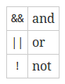
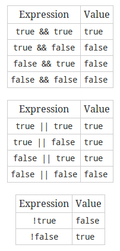

# Types

Data types categorize a set of related values, describe the operation that can
be done on them, and define they way they are stored. We used the data type
string to store `Hello World` in the last section.

Philosophers sometimes make a distinction between types and tokens. For example
suppose you have a dog named Max. Max is the token (a particular instance or
member) and dog is the type (the general concept). “Dog” or “dogness” describes
a set of properties that all dogs have in common. Although oversimplistic we
might reason like this: All dogs have 4 legs, Max is a dog, therefore Max has 4
legs. Types in programming languages work in a similar way: All strings have a
length, x is a string, therefore x has a length.

Go is a statically typed programming language, meaning that variables always
have a specific type that cannot change. Other statically typed languages
include Java and C. Dynamically typed langauges include Javascript and Ruby.

Go comes with several builtin types that we'll take a look it.

## Numbers

Generally we split numbers into two types: integers and floating-point numbers.

### Integers

Integers are numbers without a decimal component (..., -3, -2, -1, 0, 1, ...).
Unlike the base-10 decimal system we use to represent numbers, computers use a
base-2 binary system.

Our number system is made up of 10 different digits. Once we've exhausted our
available digits we represent larger numbers by using multiple digits put next
to each other. For example, the number after 9 is 10. The number after 99 is
100.

Computers do the same thing, except they only have 2 different digits to work
with. Counting in a base-2 number system looks like this: 0, 1, 10, 11, 100,
101, 110, 111, 1000, etc.

What number is 10101?

The other difference between the number system we use and the number system
computers use is that all integer types have a definite size. They only have
room for a certain number of digits. A 4 bit integer might look like this 0000,
0001, 0010, 0011, 0100. An 8 bit integer looks like 00000000, 00000001, etc.

Go's integer types are `uint8`, `uint16`, `uint32`, `uint64`, `int8`, `int16`,
`int32` and `int64`. `uint` means "unsigned integer". Unsigned integers only
contain positive numbers (or zero). The number after `uint` or `int` says how
many bits the number has. In addition, there are two alias types: `byte` which
is the same as `uint8` and `rune` which is the same as `int32`. Bytes are an
extremely common unit of measurement used on computers (1 byte = 8 bits, 1024
byes = 1 kilobyte, etc). and therefore Go's `byte` data type is often used in
definition of other types. There are 3 machine dependent integer types: `uint`,
`int`, and `uintptr`. They are machine dependent because their size depends on
the type of architecture you are using. Generally if you are working with
numbers you should use the `int` type.

### Floating Point Numbers

Floating point numbers are numbers that contain a decimal component (real
numbers). (1.234, 3.141, 0.000000123, etc). Their actual representation on a
computer is fairly complicated and not really necessary in order to know how to
use them.

Float point numbers are inexact. Occasionally it is not possible to represent a
number. For example computing `1.01 - 0.99` results in `0.020000000000000018`.

Like integers, floating point numbers have a certain size (32 bit or 64 bit).
Using a larger sized floating point number increases its precision (how many
digits it can represent).

In addition to numbers there are several other values which can be represented:
"not a number" (`NaN`, for things like `0/0`) and positive and negative
infinity (`+∞` and `-∞`).

Go has two floating point types `float32` and `float64` (also referred to
single precision and double precision respectively). `float32` is the same as
`float` in Java. `float64` is the same as `double` in Java. Generally we should
stick with `float64` when working with floating point numbers.

## Example

Let's write an example program using numbers. First create a folder called
`numbers` and make a `main.go` file containing the following:

```go
package main

import "fmt"

func main() {
  fmt.Pritnln("1 + 1 =", 1 + 1)
}
```

If you run the program, you should see this:

    $ go run main.go
    1 + 1 = 2

Notice that this program is very similar to the Hello World one we wrote
earlier. However, instead of printing `Hello World`, we print the string
`"1 + 1 ="` followed by the result of the expression `1 + 1`.

Let's try the same thing using floating point numbers:

```go
fmt.Println("1 + 1 =", 1.0 + 1.0)
```

Notice that we use `.0` to tell Go that this is a floating point number instead
of an integer. Running this program will give us the same result as before.

In addition to addition, Go has several otehr operators:

| Operator | Name               |
| -------- | ------------------ |
| +        | addition           |
| -        | subtraction        |
| *        | multiplication     |
| /        | division           |
| %        | remainder (modulo) |

## Strings

A string is a sequence of characters with a definite length used to represent
text. Go strings are made of individual bytes, usually one for each character.

String literals can be created using double quotes `"Hello World"` or back
ticks \`Hello World\`. The difference is that double quoted strings cannot
contain newlines and they allow special escape sequences. For example, `\n`
gets replaced with a newline and `\t` gets replaced with a tab character.

Several common operations on strings include finding the length of a string:
`len("Hello World")`, accessing an individual character in the string: `"Hello
world"[1]`, and concatenating (combining) two strings together: `"Hello " +
"World"`. Let's modify the program we created earlier to test these out:

```go
package main

import "fmt"

func main() {
    fmt.Println(len("Hello World"))
    fmt.Println("Hello World"[1])
    fmt.Println("Hello " + "World")
}
```
Few things to notice:

* Strings are "indexed" starting at 0 not 1. `[1]` gives you the 2nd element,
  not the first.
* Concatentation uses the same symbol as addition. The Go compiler figures out
  what to do based on the types of the arguments.

## Booleans

A boolean value is a special 1 bit integer type used to represent true and
false (or on and off). Three logical operators are used with boolean values.



The following is an example program showing how they can be used:

```go
func main() {
    fmt.Println(true && true)
    fmt.Println(true && false)
    fmt.Println(true || true)
    fmt.Println(true || false)
    fmt.Println(!true)
}
```

Running this program should give you

    $ go run main.go
    true
    false
    true
    true
    false

We usually use truth tables to define how these oeprators work.



## Conclusion

These are the simplest types included with Go and form the foundation from
which all later types are built.
